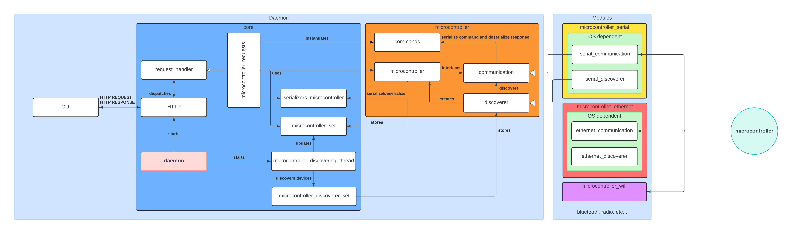
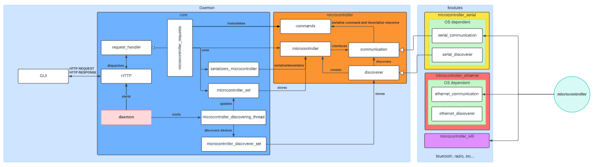
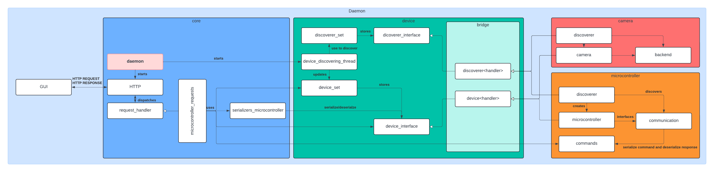

# Code Architecture Explanation

## First Approach
 
 
Snellium’s architecture is **modular**, meaning it consists of a central component that manages the overall application, referred to as the **daemon**, and smaller, independent components known as **modules**, which are integrated into the daemon’s environment.

The daemon is responsible for initializing the entire application along with its modules. It handles the instantiation of the execution context, the module manager, the threads, the server, and all required objects.

The application communicates with users through a REST API. Users or user interfaces interact with the software by sending HTTP requests to predefined API endpoints. These requests are handled by the request handler, which implements the specific logic for each request. The handler retrieves relevant objects, makes calls to gather data, processes it as necessary, and builds a response to send back to the user.

This structure outlines how the **frontend** of the software operates.

Next, we turn to the **microcontroller module**. First, a microcontroller request handler is defined to manage requests sent to the microcontroller-specific endpoints. The handler uses a microcontroller serializer to retrieve the specific object being requested from the **microcontroller set**, which holds all detected microcontroller objects. This set is periodically updated by a **microcontroller discovery thread**, which checks for new available communications.

The thread relies on the **discoverer** object to scan communication interfaces and attempt to establish a connection. If successful, the discoverer creates a communication object containing the interface information and links it to a microcontroller object. Each communication interface has its own discoverer implementation, and the thread maintains all of these discoverers in a single **discoverer_set** object. This setup allows the thread to iterate over each discoverer, scanning the interface and creating discovered devices.

The **microcontroller object** then pulls data from the communication interface and serves as the front-end for interacting with the specific microcontroller, defining the available operations for that device.

Given the modular architecture, the daemon only contains **abstractions** of the modules. It knows the specific methods it can call, and any new module must implement the module abstraction. For instance, microcontroller communication may occur over serial, Ethernet, Wi-Fi, or Bluetooth. Each communication type requires its own module implementation, such as `serial_communication_microcontroller` or `ethernet_microcontroller`. The same principle applies to the discoverer, which must scan its specific communication interface.

Finally, the **communication protocol** is the only element connecting the software to the microcontroller. The type of communication interface (serial, Ethernet, etc.) becomes irrelevant once it is implemented in the software. The microcontroller processes the serialized data sent via the protocol, and the software handles the response accordingly.

The final version of the diagram after implementing it is the following:

The file [microcontroller_module_doc](./microcontroller_module_doc.pdf) contains the actual documentation present in the code repository. It explains in a resumed way everything about the microcontroller module.

## Second Approach

During the implementation of my module, I observed significant similarities with another module responsible for discovering and managing cameras. Many methods were identical, while others were analogous, differing only in the types they used. After analyzing the situation, I proposed a refactoring that led to the creation of an abstraction module called **Device**. This module consolidates the duplicated methods, allowing individual modules to focus only on implementing device-specific functionality.

The concept was to introduce a **Device module**, serving as a higher-level abstraction layer than the individual module abstractions. Any module dealing with devices that need to be discovered and managed would implement this **Device abstraction**, incorporating only the device-specific logic. This approach reduces code duplication, provides a straightforward interface for core classes, and allows module abstractions to be more focused and specific.

In this architecture, all **device sets**, **discoverer sets**, and **threads** are handled within the new module. The methods employed in these classes must be implemented by any device, ensuring consistent and easy setup. To achieve this, **Device** and **Discoverer interfaces** were introduced. For the analogous code that varies only by the type of device handler, such as communication or backend classes, a bridge section was created with **template classes** for devices and discoverers. These template classes are still abstract, while the module abstraction defines the specific device handler types.

