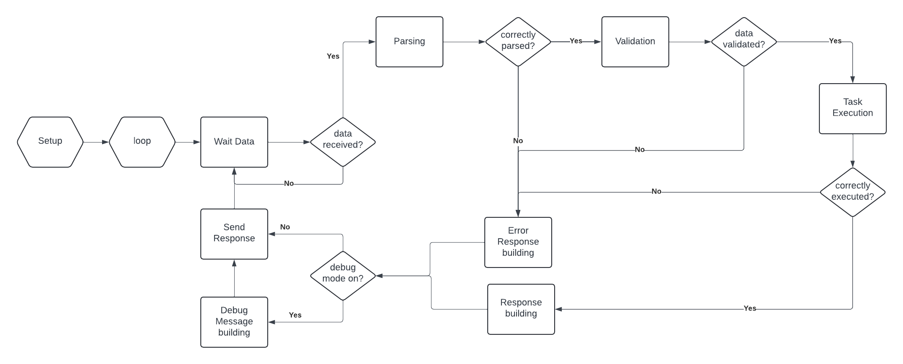

# Firmware Code Architecture

### Firmware Operation Overview

The firmware running on the microcontroller is designed to handle command-based communication with the daemon. The operation of the firmware is straightforward and consists of the following main steps:

1. **Initialization**:Initialize the communication interface, constants, and any devices required for operation.
2. **Main Loop**:
    - **Waiting for Data**: The firmware enters a loop where it waits for data to arrive on the communication interface. During this waiting period, the firmware remains idle, as its primary role is to react to commands received from the software. There are no sensors or additional elements to check in this state.
	1. **Data Reception**: When data becomes available, the firmware reads the entire message block, starting from the character following the *STX* (Start of Text) character until the *ETX* (End of Text) character. 
	2. **Message Parsing**:
	    - **Tokenization**: The serialized string is broken down into tokens. Each token is used to populate a struct designed to hold the parsed data. This struct captures the entire message and organizes the command tokens for further processing.
	    - **Validation**: The parsed data is validated to ensure correctness. The firmware checks that the command tokens are valid and that the combination of tokens adheres to expected formats. For example, it verifies that commands with no arguments do not include any arguments and vice versa.
	3. **Task Execution**: Once the command struct is validated, the firmware identifies the task by reading the command name. It then executes the corresponding function, passing the command struct as a parameter.
	4. **Response Construction**: If the task executes successfully, the firmware constructs a response message and sends it back to the software, which awaits the response.
	5. **Error Handling**: If an error occurs during command execution, the error handler is invoked. The handler generates a specific error message to be sent back to the software.
	6. **Debug Message** : It is the last message to be processed and it is only built if the debug mode is on. Developer can concatenate message from anywhere in the code in here.

By following these steps, the firmware ensures efficient command processing and reliable communication between the microcontroller and the daemon.
