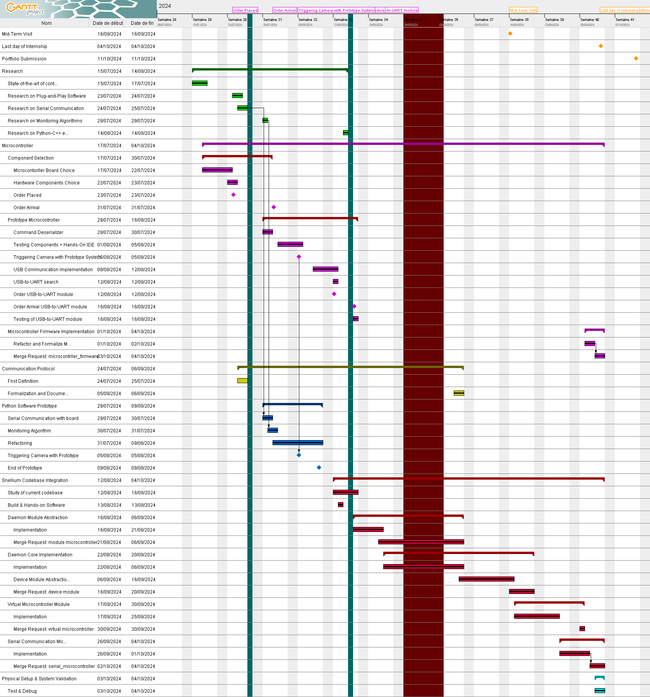

# MID-TERM : Project Tasks & Planning

> Cf. [Internship Project - Gantt Diagram](portfolio/2 - project/internship_gantt_chart_portrait.pdf|internship_gantt_chart_portrait)

The project was divided in several phases:
1. **Research:**
	- Relative to research tasks
	- More often at the start of the project
2. **Microcontroller:**
	- Concern any development on microcontrollers
	- Concern prototype firmware, going through hands-on board IDE and components until the formal, reviewed and final firmware.
3. **Communication Protocol:**
	- Concerned any task related to communication protocol definition
	- Protocol refinements happened during python prototype and snellium codebase integration tasks but final version was documented in a separate task
4. **Python Software Prototype**
	- Consist in creating a simple version of the software that can achieve the same goal as the system we are designing
	- Once done, it was refactored to fit snellium requirements on software architectures
5. **Snellium Codebase Integration**
	- Concerns the process of writing code in the current software codebase in a separate branch and merge those changes once completely refined and reviewed
6. **Physical Setup & System Validation**
	- Consists on install the whole system and verifying if its functional goals are achieved
	- Debugging whenever got a problem
7. **Late Zone**
	- Last week of internship
	- Left for eventually delays or documentation checking and refinements

Notice the big vertical red strip on the calendar. It represents a time off granted by my supervisor to allow me to prepare for my second session exam, which took place on Monday, September 2nd. The exam, **ELECH473 Microprocessors Architecture**, was quite extensive, and I required sufficient time to prepare for it.

I asked this time off as I was unable to prepare the exam in my free time. The internship location was too far from my residence, resulting in a daily commute of nearly four hours. After a full day of work and the lengthy commute, it was hard to study effectively. Upon reviewing the internship convention, we were unable to locate any specific article addressing days off granted by supervisors for such purposes. However, my supervisor kindly agreed to my request, and the time off proved essential for my preparation.

This week off allowed me to pass the exam with a mark of 15/20, and I would like to express my sincere gratitude to my supervisor for providing this opportunity.

# END OF INTERNSHIP: Planning

> Cf. final_internship_gantt_chart.pdf for a more detailed view of the internship planning.

In the final version of the internship planning, one can notice that the end of the project took more time than planned. Indeed, the last week that was suppose to be a late zone, and specially a test and debug zone, were taken by the end of the software implementation and firmware refactoring. Lots of parallels tasks were done at the end.

## Conclusion

The beginning of the project was not strictly planned because time was need to get used to the environment and to deeply understand the project and its working charge. Thus, the project advanced task by task without a long-term planning. 

Once the prototyping phase concluded, the software implementation had began. This phase was easier to estimate and plan. Thanks also to code review and the closer communication to my supervisor, I could receive feedback about my pace of advancement and set some light deadlines.

By the end of the project, it was clear that I would not have time to finish successfully without imposing a more strict and faster pace. This is when the harsh deadlines were set and the project was planned until its end. However, time was short and the complexity of debug and errors increased. Each new step became more difficult to implement, taking more time to finish, review and debug.  

In conclusion, the project was managed in a more flexible manner and it maintained a regular pace during two thirds of it. However, the pace of advancement should have been faster in order to conclude successfully the project and have time to test and debug everything. 