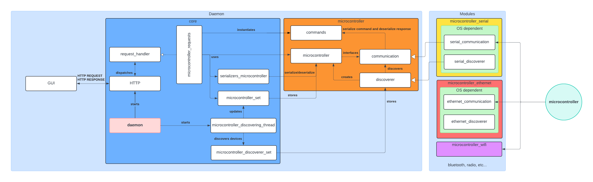
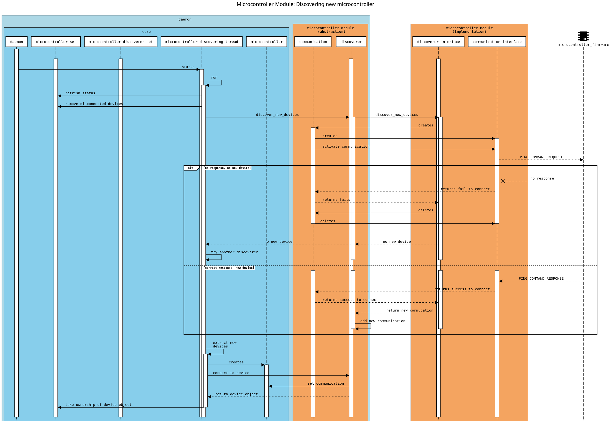
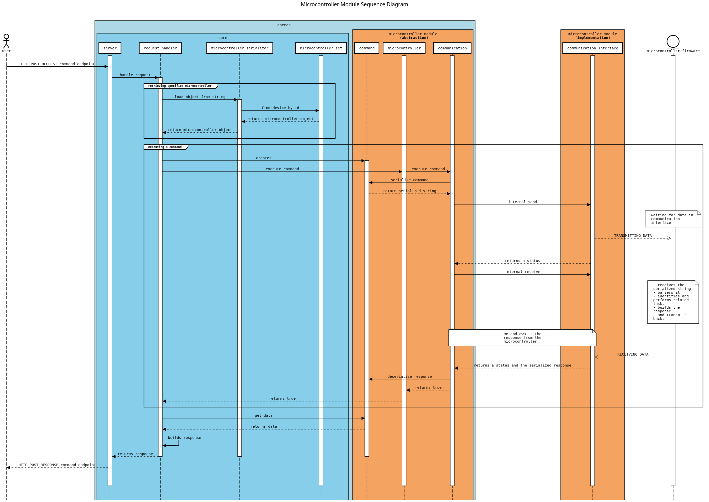

# microcontroller module

The daemon includes features to detect, connect, and execute commands on microcontrollers. These microcontrollers are
the core devices to control units, responsible for triggering cameras, controlling motors, and similar tasks. The
`microcontroller` module, like the `camera` module, functions as an abstraction layer over various microcontroller
libraries, providing a unified interface.

## Architecture

The architecture of the `microcontroller` module mirrors the `camera` module, as both are devices that require software
interaction.

The `Microcontroller` class serves as the front-end for caller code. Each `Microcontroller` holds a reference to a
`Communication` instance, which is an abstract class managing all hardware communication, including connection and
command execution. For each communication interface, a new subclass of `Communication` is created, while the
`Microcontroller` class remains universal.

The `Discoverer` class acts as a factory for microcontrollers. It listens for incoming connections and creates the
corresponding `Microcontroller` and `Communication` instances. This class must also be subclassed for each communication
interface since it should listen to different communication interface.

The `Command` class is an abstract class responsible for the serialization of commands and deserialization of responses.
Each specific command inherits from `Command` and defines the command to be sent to the microcontroller. Commands must
align with the microcontroller's protocol, and adding a new command requires updating the microcontroller's firmware to
recognize and execute it. The `Command` class also stores the response from the microcontroller and provides an
interface to access it.

Here is a class diagram of the `microcontroller` module:

## Using Microcontrollers

The `Microcontroller` class offers an interface allowing the caller to retrieve information about the microcontroller,
activate or deactivate it, and execute commands.

To use a microcontroller, the caller must first invoke `activate_communication` to set the microcontroller to an
`ACTIVE` state, enabling communication with the software. Once activated, the caller can instantiate the desired
*command class* and execute it by passing the command reference into the `execute_command` method of the
`Microcontroller` object. This method will serialize the command, send it to the microcontroller, wait for the response,
and then deserialize it. The method also returns a boolean indicating the success of the command and stores
the response in the `Command` object. The caller can then access the data through the `Command` object.

Once finished, the caller should use `deactivate_communication` to close the connection and set the device to an
`INACTIVE` state.

If the microcontroller is physically disconnected from the computer, the `Communication` instance will set its state to
`DISCONNECTED`, and it will be removed from the `Discoverer` list, freeing its resources.

## Discovering Microcontrollers

The `Discoverer` class is responsible for detecting and connecting to microcontrollers. It listens for incoming
connections and creates the corresponding `Microcontroller` and `Communication` instances.
A new module must be created for each communication interface, such as serial, network, or wireless, and the
`Discoverer` class must be subclassed for each module. The execution context holds a reference to each `Discoverer`
subclass in a `DiscovererSet`, allowing the daemon to discover and connect to microcontrollers using different
communication interfaces.

The `DeviceDiscoveringThread` class is responsible for running each `Discoverer` instance in a separate thread,
allowing the daemon to discover and connect to microcontrollers asynchronously.

The discovery process is simple and consists of the following steps:

1. The `Discoverer` listens for incoming connections.
2. Upon detecting a new microcontroller, the `Discoverer` creates a new `Communication` instance.
3. It tries to connect to the microcontroller by executing a `ping` command.
4. If the response is correct, it is a valid microcontroller, and the `Discoverer` keeps the `Communication` instance in
   a list of new devices.
    1. The `DeviceDiscoveringThread` upon detecting that a new communication instance is available, asks the
       discovery to create a new `Microcontroller` instance and associate it with the communication instance.
    2. The `DeviceDiscoveringThread` passes the ownership of the new `Microcontroller` instance to the
       `MicrocontrollerSet`.
5. If the response is incorrect, the `Discoverer` discards the `Communication` instance.
    1. If the current discoverer has no new devices, the `DeviceDiscoveringThread` continues iterating over the
       `DiscovererSet`.
    2. At the end of the iteration, the `DeviceDiscoveringThread` sleeps for a specified time before starting
       the next iteration.

Here is a sequence diagram of the discovery process:

## Microcontroller Communication Protocol

### Commands

The communication protocol between the daemon and the microcontroller is based on a simple text-based format using ASCII
characters for commands and responses. The protocol is designed to be straightforward and easy to implement on both the
daemon and microcontroller firmware.

Commands come in two types: `Command` and `CommandWithArguments`.

The syntax for these commands is as follows, with spaces separating the fields (note that spaces are not part of the
actual serialization):

- **Command**: `STX <command_name> ETX`
- **CommandWithArguments**: `STX <command_name> GS <argument_number> US <arg_1> US <arg_2> US ... US <arg_n> ETX`

Where:

- **STX** is the start of text character (0x02), referred to as `start of command` in the protocol code.
- **ETX** is the end of text character (0x03), referred to as `end of command`.
- **GS** is the group separator character (0x1D), referred to as `block delimiter`.
- **US** is the unit separator character (0x1F), referred to as `element delimiter`.
- **command_name** is the name of the command (e.g., "info", "ping", "set-mode", "trigger-all-cameras").
- **argument_number** is the number of arguments.
- **arg_1**, **arg_2**, ..., **arg_n** are the command arguments.

### Responses

The microcontroller responds to each command with a message following this format:

- **Response**: `STX <status> GS <command_name> US <message> GS <debug_message> ETX`

Where:

- **STX** is the start of text character (0x02).
- **ETX** is the end of text character (0x03).
- **GS** is the group separator character (0x1D).
- **US** is the unit separator character (0x1F).
- **status** indicates the outcome of command execution (`success` or `internal error`).
- **command_name** refers to the command for which the response is being sent.
- **message** contains the data returned by the command or an error message if `internal error`.
- **debug_message** is optional and provides additional information for debugging, present only in `MODE_DEBUG`.

### Example Commands and Responses

- **Command**: `STX info ETX`
- **Response**:
  `STX success GS info US 12345 US microcontroller_name US board_name US microcontroller_unit_type GS ETX`

- **Command**: `STX ping ETX`
- **Response**: `STX success GS ping US pong GS ETX`

- **Command**: `STX set-mode GS 1 US debug ETX`
- **Response**: `STX success GS set-mode US mode set debug GS debug_message ETX`

- **Command**: `STX trigger-all-cameras ETX`
- **Response**: `STX success GS trigger-all-cameras US triggered-all-cameras GS ETX`

- **Command**: `STX invalid-command ETX`
- **Response**: `STX internal error GS invalid-command US unknown command GS ETX`

## Microcontroller Firmware

The microcontroller firmware is responsible for receiving commands from the daemon, parsing them, executing the
associated tasks, and returning the response. The firmware must adhere to the communication protocol described above.

The firmware processes a command as follows:

1. Receives a command from the daemon.
2. Parses the serialized string into tokens and fills a command structure.
3. Identifies the command and executes the corresponding task with the provided arguments.
4. Constructs the response message during task execution.
5. Sends the response message back to the daemon upon task completion.

The firmware is designed to continuously listen to its communication interface. Upon receiving a new command string, it
parses and executes the associated task.

## Cameras Triggering Example

The following example demonstrates how the daemon triggers all cameras connected to a microcontroller:

1. The user makes a request to the daemon to trigger all cameras by POST request on the specified endpoint.
2. The daemon handles the request by:
    1. Activating the microcontroller communication.
   2. Instantiating the command class for triggering all cameras.
   3. Executing the command through microcontroller frontend object of the specified device.
        1. The communication object serializes the command and sends it to the microcontroller via the communication
           interface.
        2. The microcontroller firmware :
            1. Receives the command.
           2. Parses the command and identifies the task associated with it.
            3. Triggers all cameras connected to the microcontroller.
            4. Constructs the response message.
            5. Sends the response message back to the daemon.
       3. The communication object receives the response message and set it in the command object.
       4. The command object deserializes the response message and stores the response data in its fields.
       5. The executing method returns a boolean indicating the success of the command.
    4. Deactivating the microcontroller communication.
    5. Returning the response to the user.
3. The user receives the response from the daemon, indicating the success of the command.
4. The cameras connected to the microcontroller are triggered.
5. The user can now access the captured images from the cameras.

Here is a sequence diagram of the process:

   
